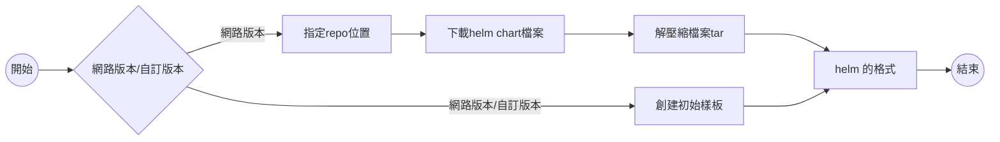

# 【HELM 教學】

## 流程




## 指定repo位置`B1`
```
$ helm repo add my-repo https://charts.bitnami.com/bitnami
```

## 下載helm chart檔案`B2`
- 下載redis-cluster
- 檔案為 : redis-cluster-8.3.8.tgz
``` cmd
$ helm pull my-repo/redis-cluster
```

## 解壓縮檔案tar`B3`
- 下載的檔案最新版目前為:redis-cluster-8.3.8.tgz
```
tar xvf redis-cluster-8.3.8.tgz
```

## 創建初始樣板 `C1`
```
helm create helm-demo
```

## Chart 的格式
```
.
├── Chart.yaml
├── charts
├── templates
│   ├── deployment.yaml
│   ├── ingress.yaml
│   └── service.yaml
└── values.yaml
```

## 查看版本樣式
> 需與 Chart.yam相同目錄
```
helm template .
```

